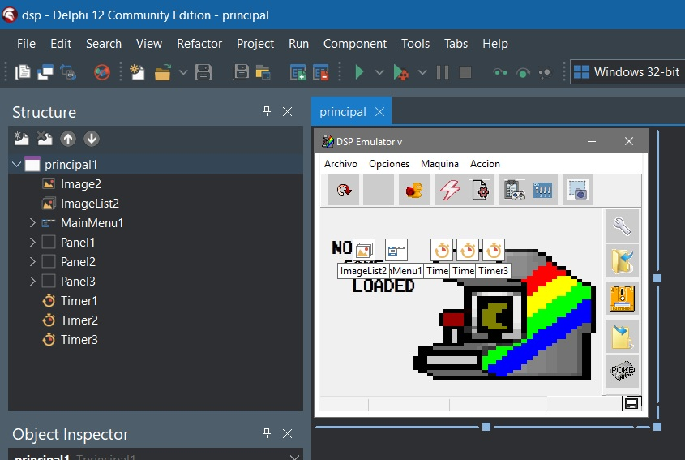
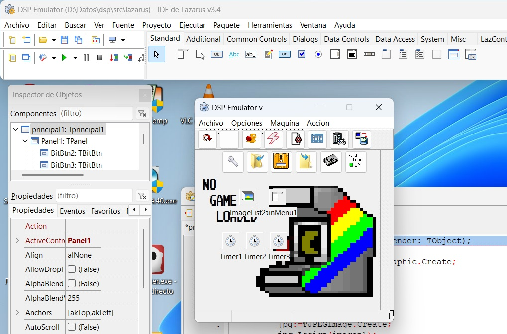

<h1>DSP Emulator - How to compile</h1>
This is a small 'how to' for compiling DSP emulator  
<b>1-. First step - Choose IDE compiler</b>

---

You can choose two ways to compile DSP emulator
- RAD Studio IDE: For Windows only
- Lazarus IDE: For Windows, Linux, MacOS and others

Keep in mind that the final version works without problems with the different compilers, but the WIP version the compilation may fail in Lazarus IDE, but works fine in RAD Studio. 
There is no external dependencies for compiling, you don't need to install any external library, just the IDE you like. 
The compilation it's very fast... No more than 10 seconds, with more than 230.000 code lines... 
Remember, if you want to run the emulator after compilation, you need the SDL2 library if you use RAD Studio, and for Lazarus IDE you need SDL2 and SDL-Mixer2 and, of course, the ROMs for the emulated system. 
The source stable version, is located on 'Release XXX' folder. 
The WIP source version, is located on 'src' folder. 

<b>2-. RAD Studio IDE</b>

---

If your OS is Windows, the best option it's RAD Studio Community Edition. Works fine with Delphi 11 or Delphi 12 Community Version Edition. 
You can download it from https://www.embarcadero.com/products/delphi/starter/free-download/ 
After register, download and install, download the emulator source code, and then open the DSP Emulator project. 
- Menu File --> Open Project --> go to folder 'src\delphi' --> select 'dsp'

Now you can open units, forms or compile the emulator. You can also change between 32/64 bits for final executable compilation.

<b>3-. Lazarus IDE</b>

---

With Lazarus IDE you can compile DSP Emulator for many platforms, I've tested Windows, Linux, MacOS and Raspberry.Works fine with versions from 2.X to 3.X. 
You can download it from https://www.lazarus-ide.org/ 
After download and install (no registration needed), download DSP emulator source code, and open the project.
- Menu File --> Open --> change to 'Lazarus project (*.lpi)' --> go to folder 'src\lazarus' --> select 'dsp'

Now you can open units, forms or compile the emulator. 
If you want compile for another OS, you need to download the cross-platform complements.

If you have any question or suggestion, please contact me at leniad2[@]hotmail.com!

v1.0.2