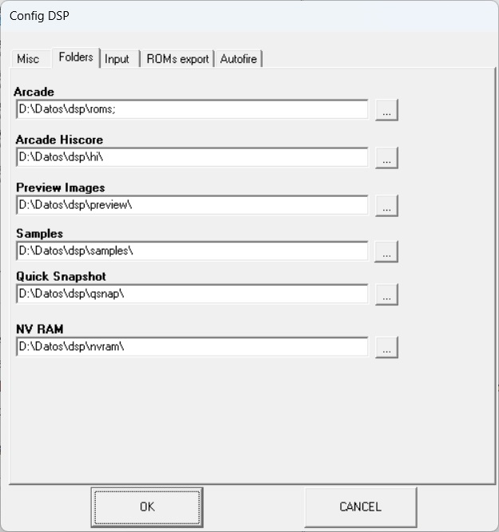
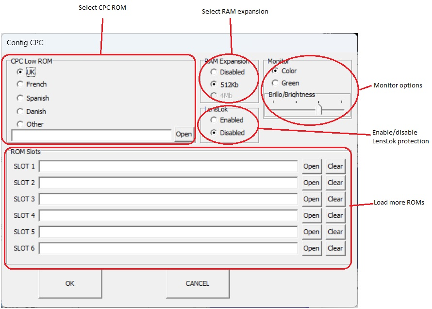
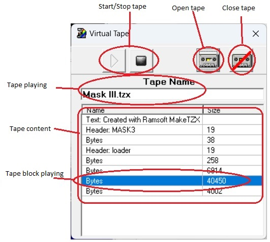
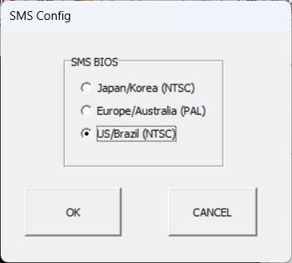
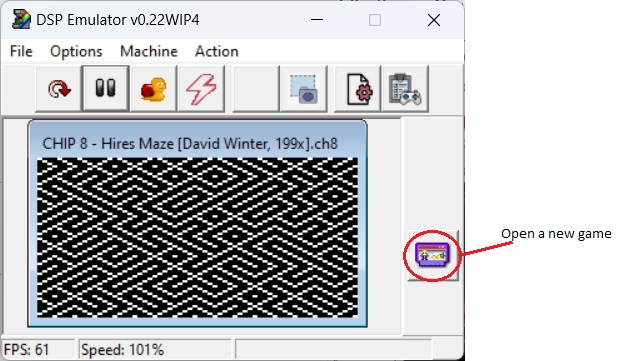

<h1>DSP Emulator - Small guide</h1>

This is a small guide for use DSP Emulator. 
The emulator is designed to be easy to use, there are no complicated options, everything is designed to be "plug and play" and the default options work for almost all games. 
Just a couple of definitions:
- ROMs --> It means Read-Only-Memory, it's just a program data, video data, graphics data, etc. recorded in a single chip. Thanks to clever people, this data is extracted (some times it's very hard!) and saved into a file. If you put all files from the game into a zip, you have a 'set', and that's what you need to play a game, console game or computer.
- Samples --> Many older arcade games use analog devices to play sounds and music, this is very hard to emulate, so we use 'samples' (Mario Bros, Donkey Kong, Galaxian...). A sample it's a small piece of recorded sound directly from the arcade, and played at the right moment, it looks like the original sound. Like ROMs, you only need to put them all together in a single zip.

<b>1-. Main menu</b>

------

Here you can set the main options, select the arcade game, console, computer to play, redefine controls, video settings...

The main menu, where you can select the main options:
- File
  - Language --> You can select DSP language from 7 available
  - ROMs List --> Open available emulated systems menu (arcade, consoles, etc) in a list format, see section 1.2 for more info
  - Exit --> Close emulator
  - About --> Open 'about' emulator menu
- Options
  - Sound --> Enable/Disable sound
  - Video --> Choose video settings
  - Configuration --> Open main config menu, see section 1.1 for more info
- Machine --> Change the emulated system directly (not from the list menu)
- Action
  - Run --> Resume selected system
  - Reset --> Reset selected system
  - Pause --> Pause selected system

The buttons are short-cuts to some options:
- Reset --> Reset selected system, you can press F3 also
- Play/Pause --> Resume/pause selected system
- Slow speed --> Select slow (50%), very slow (25%) or ultra slow speed (12%) of the selected system
- Fastest speed --> Go as fast as your computer can, press F2 also
- Take picture --> Take a picture of the actual system
- Config menu --> Open main configuration options menu, see section 1.1 for more info
- Open list menu --> Open available emulated systems (arcade, consoles, etc) in a list format, see section 1.2 for more info.

On the status bar, you can see:
- FPS --> Frames per second, the quantity of pictures drawn every second
- Speed --> In percentage, the speed of the emulation. 100% is the perfect speed, below the emulation is slow, above it's too fast.

<b>1.1-. Main Options</b>

------
In this window you have five pages to configure some options of the emulator. They are very simple!

**1.1.1-. Misc**

All the options here are the same that you can select in the main menu (see section 1), except the last one:
- Run the last game at start-up --> If this option is selected, when DSP starts, it will run the last system it was running before it was closed, if not, the emulator will start with the list menu (see section 1.2).
- Show ROMs errors --> If set, when DSP detects a bad ROM file will show a window with the bad file
- Center main screen --> When a new system is starting, the main window will go to the center of the screen
- CONSOLES: Show game loading menu at start-up --> When a console is started and this check it's selected, the 'open game' window it's show, otherwise, you need to press the button 'open game' on the right menu (no game select window will be opened at start-up).

**1.1.2 Folders**

Here you can select the folders where the need files or the output files will reside. 
Press the button with three dots '...' and select a new folder. 
On the Arcade option, you can add extra folders, splitted by semicolons, for example 'c:\folder1;d:\roms\folder2'

**1.1.3 Input**

Here you can select the controls for all systems. If you have joystick(s) connected, you can select the device from the joystick list and calibrate it pressing the 'Get Center' button. 
If keyboard is selected and you want to change a control, just press the button and a new window will be show. Select the key from the virtual keyboard.

If you use a joystick, just press the button you want to change, and then press the button in the joystick to select it. 

**1.1.4 ROMs export**

This section it's for export the ROMs and the samples info in a format for using a ROM manager, like 'ROM Center'. 
It's useful to check missing ROM files, missing samples, broken files, etc.

**1.1.5 Autofire**

Here you can enable/disable autofire. 
Instead of pressing insanely the fire button, you can select autofire and the emulator will do the magic, emulating the repetitive pressing of the button. 
You can enable/disable any button of both players, and applies for any type of control, keyboard or joystick.

<b>1.2-. List menu</b>

------
Here you can select from the list the arcade, computer, console or G&W you want to play. 

You can use the sort options to filter the list:
- All --> Show everything available
- Computers --> Show only computers
- Consoles --> Show only consoles
- Game & Watch --> Show G&W games
- Arcade --> Show arcade games, you can also filter for arcade type:
	+ Sport
	+ Run & Gun
	+ Shot
	+ Maze
	+ Fight
	+ Drive

In the column 'ROM found', you can see the availability of the ROMs sets, there are three options:
- Yes --> The ROMs are available, you can play the system
- No --> The ROMs are not available, you can't play
- N/A --> The system don't use ROMs, you can play it, but you need extra files for playing, for example a console cartridge.

On the right side you can see a small info of the selected system and a preview picture.

<b>2-. Computers</b>

------

There are four computer systems that DSP can emulate:
- Spectrum series
- Amstrad CPC series
- Commodore 64
- Oric series

Commodore 64 and Oric, can only play tapes at this moment, for more info about virtual tape see section 2.3.

**2.1-. Spectrum series**

There are six models emulated, all support tape and one have disk drive (section 2.4).

The spectrum have a special tape/snapshot menu, which have a preview of the game and some info.

Those are the options in config menu:

- Spectrum 48K issue --> There are variations in the original Spectrum 48K, some games need older issue 2, and many are compatible with the issue 3
- LensLok --> Enable/disable LensLok copy-protection
- Border emulation --> Border emulation is time consuming, to avoid this there are three options:
	+ Disabled: no border emulation (fastest)
	+ Normal: Emulated line by line (normal speed)
	+ Full: Emulated pixel by pixel (slow speed)
- Joystick --> Select the joystick model
- Mouse --> Select mouse type
- ULA+ --> Enable/disable ULA+ extended colors
- Spectrum 128K audio --> Spectrum models 128K, +2, +2A and +3 have a special audio chip, this option defines the output
- Speaker oversample --> Enable/disable enhancing the quality of the Spectrum speaker
- Turbo Sound --> Enable/disable turbo sound hardware
- Tape audio --> Enable/disable listening sounds from the virtual tape
- ROM --> Select a different ROM for the Spectrum model emulated

**2.2-. Amstrad CPC series**

There are three models emulated, all of them support tape (section 2.3) and two of them have disk support (section 2.4).

Those are the config options

You can select:
- CPC ROM --> Select the ROM, based on the country location or select a specific one
- Expansion RAM
	+ Disabled (no expansion)
	+ 512Kb expansion
	+ 4Mb expansion (not working)
- LensLok --> Enable/disable virtual window for LensLok copy-protection
- Monitor Options
	+ Select Color/Green monitor
	+ Select brightness (green monitor only)
- ROMs slots --> add more ROMs into slots 1 to 6

**2.3-. Tape window**

All the computers emulated support tape loading, and all use the same window for control virtual tape. 
When you open a tape file, a window for virtual tape will appear.

You can play/pause a tape, open a new tape file or close virtual tape window. 
In this window, use the mouse for select the tape block you want, and the emulator will start playing from there. 
When tape come to the end, will stop and rewind to the first block. 
Some computers have auto-start, Spectrum, Amstrad CPC and Commodore 64 will start/stop the tape automatically.

**2.4-. Disk window**

When you choose a system that supports disk, a new window will open.

Here you can browse your drive, then select a disk image. 
If the disk image is a zip file, you can see the content of the file, and if there is more than a virtual disk file, you can select the one you need.

<b>3-. Arcade</b>

------
After select the arcade game you want to play (from 'Machine' menu or list window), you can play with the keyboard/joystick selected and configured in the main options (insert coin, start P1/P2, autofire...).

The options you can change are 'DIPs switches', they are like configure options for arcade games. 
Every arcade have their own DIPs. 
To change, expand the DIP you want and select the new value.

<b>4-. Console</b>

------
The emulated consoles are easy to use, just select the system, open a cartridge (game) and play. 
There are eight systems available, some of them have some special options.

**4.1-. NES**

This system don't have options. Just press button to open a cartridge game, and play. 
The only trouble you can find are cartridge 'mappers', maybe the game you try to load have a mapper not supported (an error is show) or the mapper is incomplete. 
Please read the DSP documentation for supported mappers (there are many of them).

**4.2-. Sega Master System**

The options for this system are very simple, just one. 
You only need to choose the country (BIOS) of the console, Japan, Europe or US. 
Some games need a specific BIOS to play, many others play with all BIOS.

**4.3-. Gameboy/Gameboy Color**

This system have only one option, you can choose between two palette colors, for GameBoy only.

**4.4-. ColecoVision**

This system have support for save snapshots.

**4.5-. Super Cassette Vision**

**4.6-. SG-1000**

**4.7-. CHIP-8**

**4.8-. Sega Game Gear**

<b>5-. Game & Watch</b>

------
There are three supported games, one of them is WIP (not working). 
There are no options, just press 'start P1' for Game-A or 'start-P2' for Game-B.

If you have any question or suggestion, please contact me at leniad2[@]hotmail.com!

v1.0.3