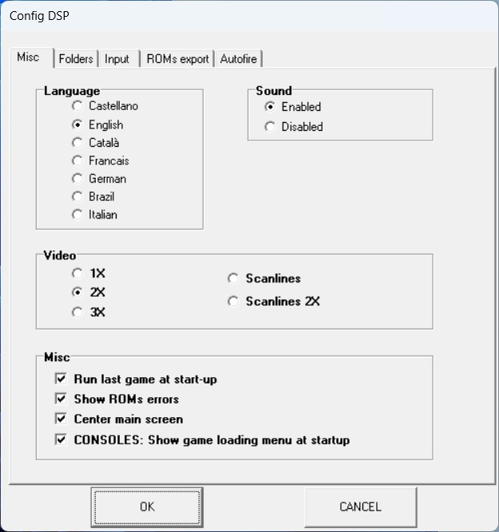
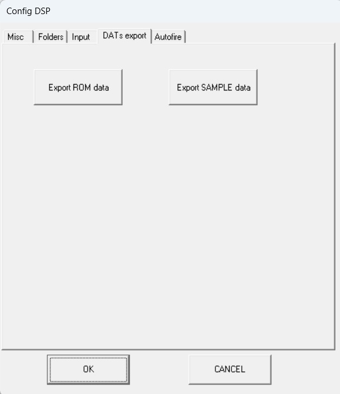

<h1>DSP Emulator - Small guide</h1>

This is a small guide for use DSP Emulator. 
The emulator is designed to be easy to use, there are no complicated options, everything is designed to be "plug and play". 
Just a couple of definitions: 
-ROMs --> It means Read-Only-Memory, it's just a program data, video data, graphics data, etc. recorded in a single chip. Thanks to clever people, this data is extracted (some times it's very hard!) and saved into a file. If you put all files from the game into a zip, you have a 'set', and that's what you need to play a game. 
-Samples --> Many older arcade games use analog devices to play sounds and music, this is very hard to emulate, so we use 'samples' (Mario Bros, Donkey Kong, Galaxian...). A sample it's a small piece of recorded sound directly from the arcade, and played at the right moment, it looks like the original sound. Like ROMs, you only need to put them all together in a single zip.

<b>1-. Main menu</b>

------
Here you can set the main options, select the arcade game, console, computer to play, redefine controls, video settings...

The main menu, where you can select the main options:
- File
  - Language --> You can select DSP language from 7 available
  - ROMs List --> Open available emulated systems menu (arcade, consoles, etc) in a list format
  - Exit --> Close emulator
  - About --> Open 'about' emulator menu
- Options
  - Sound --> Enable/Disable sound
  - Video --> Choose video settings
  - Configuration --> Open main config menu
- Machine --> Choose the system to emulate directly, divided in '8bits computers', 'Arcade', 'Consoles' and 'Game & Watch' (not the list menu)
- Action
  - Run --> Resume selected system
  - Reset --> Reset selected system
  - Pause --> Pause selected system

The buttons are short-cuts to some options:
- Reset --> Reset selected system, you can press F3 also
- Play/Pause --> Resume/pause selected system
- Slow speed --> Select slow (50%), very slow (25%) or ultra slow speed (12%) of the selected system
- Fastest speed --> Go as fast as your computer can, press F2 also
- Take picture --> Take a picture of the actual system
- Config menu --> Open main configure options menu
- Open list menu --> Open available emulated systems (arcade, consoles, etc) in a list format

On the status bar, you can see:
- FPS --> Frames per second, the quantity of pictures drawn every second
- Speed --> In percentage, the speed of the emulation. 100% is the perfect speed, below the emulation is slow.

<b>1.1-. Main Options</b>

------
In this window you have five pages to configure some options of the emulator. They are very simple!

**1.1.1-. Misc**

All the options here are the same that you can select in the main menu, except the last one
- Run the last game at start-up --> If this option is selected, when DSP starts, it will run the last system it was running before it was closed
- Show ROMs errors --> If set, when DSP detects a bad ROM file will show a window with the bad file
- Center main screen --> When a new system is starting, the main window will go to the center of the screen
- CONSOLES: Show game loading menu at start-up --> When a console is selected if the check it's selected, the open game window it's opened, otherwise, you need to press the button 'open game' on the right menu

**1.1.2 Directory**

Here you can select the folder where the need files or the output files will reside.
Press the button with three dots '...' for select the new folder. 
On the Arcade option, you can add extra folders, splitted with semicolons, for example 'c:\folder1;d:\roms\folder2'

**1.1.3 Input**

Here you can select the controls for all systems. If you have joystick(s) connected, you can select the device from the joystick list.
If keyboard is selected and you want to change a control, just press the button and a new window will be show. Select the key from the virtual keyboard.

If you use a joystick, just press the button you want to change, and then press the button in the joystick to select it. 
There is another option with the joystick, 'calibrate'. If your directional control on the joystick don't work, select this option, and move in all directions the controls for calibrate.

**1.1.4 ROM**

This section it's for export the ROMs info in a format for using a ROM manager, like 'ROM Center'. 
It's useful to check missing ROM files, missing samples, broken files, etc.

**1.1.5 Autofire**

Here you can enable/disable autofire. 
Instead of pressing insanely the fire button, you can select autofire and the emulator will make the magic, emulating the repetitive pressing of the button. 
You can enable/disable each button of both players, and applies for any type of control, keyboard or joystick.

<b>1.2-. List menu</b>

------
Here you can select from the list the arcade, computer, console or W&G you want to play. 

You can use the sort options to filter the list:
- All --> Show everything available
- Computers --> Show only computers
- Consoles --> Show only consoles
- Game & Watch --> Show W&G games
- Arcade --> Show arcade games, you can also filter for arcade type
	+ Sport
	+ Run & Gun
	+ Shot
	+ Maze
	+ Fight
	+ Drive

You can see the availability of the systems ROMs, there are three options
- Yes --> The ROMs are available, you can play the system
- No --> The ROMs are not available, you can't play
- N/A --> The system don't use ROMs, you can play it

On the right side you can see a small info of the selected system and a preview picture

<b>2-. Computers</b>

------

There are four computer systems that DSP can emulate:
- Spectrum series
- Amstrad CPC series
- Commodore 64
- Oric series

Commodore and Oric, can only open tapes at this moment, you can go to the 'tape menu' for more info.

<b>2.1-. Spectrum options</b>

------

<b>2.2-. Amstrad CPC options</b>

------

<b>2.3-. Tape menu</b>

------

<b>3-. Arcade</b>

------
After select the arcade game you want to play (from 'Machine' menu or list window), you can play with the keyboard/joystick selected and configured in the main options.

The only options you need to change are 'DIPs switches', the are like configure options for arcade games. Every arcade have their own DIPs, expand the DIP you want to change and select the new one.

<b>4-. Console</b>

------

<b>4.1-. NES</b>

------

<b>4.2-. Sega Master System</b>

------

<b>4.3-. Gameboy/Gameboy Color</b>

------

<b>4.4-. ColecoVision</b>

------

<b>5-. Game & Watch</b>

------

If you have any question or suggestion, please contact me!